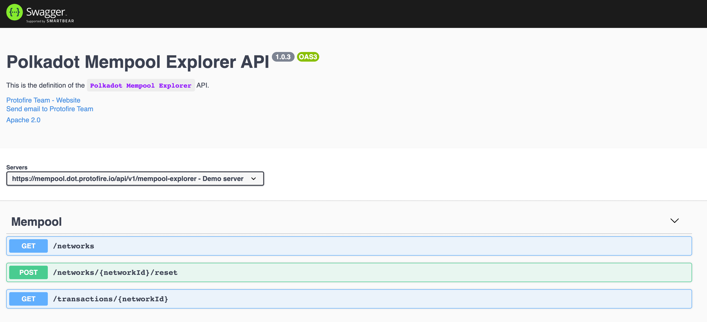

# Polkadot Mempool Explorer API

Mempool Explorer API Definition [api-docs](http://localhost:8081/api/v1/api-docs/#/).

## Environment setup

 - Install [Node.js](https://nodejs.org/)
   - Recommended method is by using [NVM](https://github.com/creationix/nvm)
   - Recommended Node.js version is v12

## Demo

http://localhost:8081/api/v1/api-docs/#/

## Get Started

In the project directory, you can run:

### `npm start`

Runs the NodeJs service in the development mode.\
Open [localhost:8081/api/v1/api-docs](http://localhost:8084/api/v1/api-docs) to view it in the browser or Postman.

The service will reload if you make edits.

### `npm run test`

Running the unit tests.

## Mempool Explorer API Definition

## Endpoints

 - `/networks`: Get networks [specs](https://github.com/protofire/polkadot-mempool-explorer/blob/main/api/routes/explorerApiDocumentation.js#L32-L65).
 - `/networks/:networkId/reset`: Reset the listener for a network id. [specs](https://github.com/protofire/polkadot-mempool-explorer/blob/main/api/routes/explorerApiDocumentation.js#L66-L95).
 - `/transactions/:networkId`: Get transactions by network id. [specs](https://github.com/protofire/polkadot-mempool-explorer/blob/main/api/routes/explorerApiDocumentation.js#L96-L133).